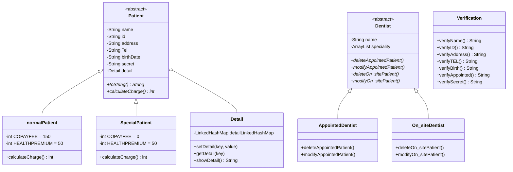
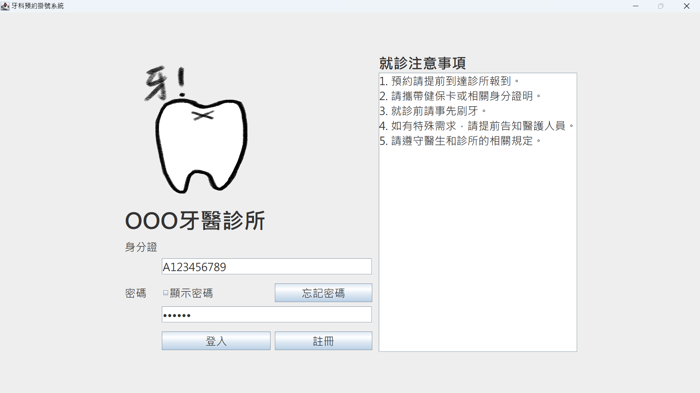
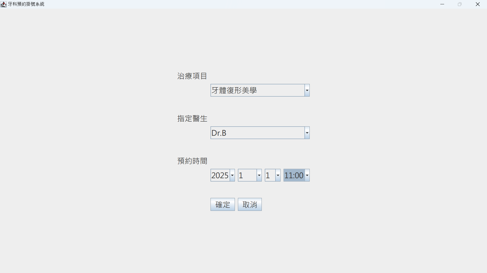
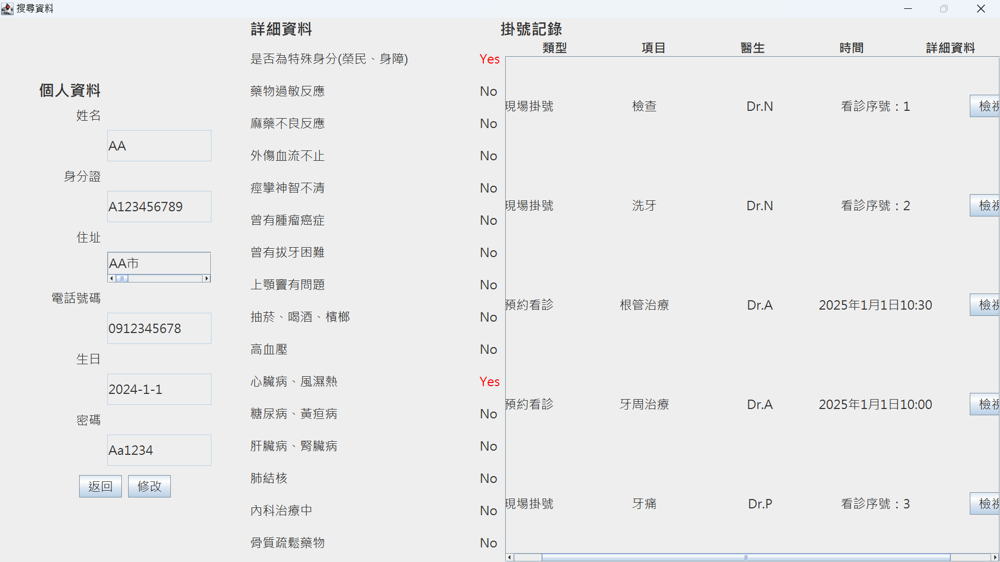
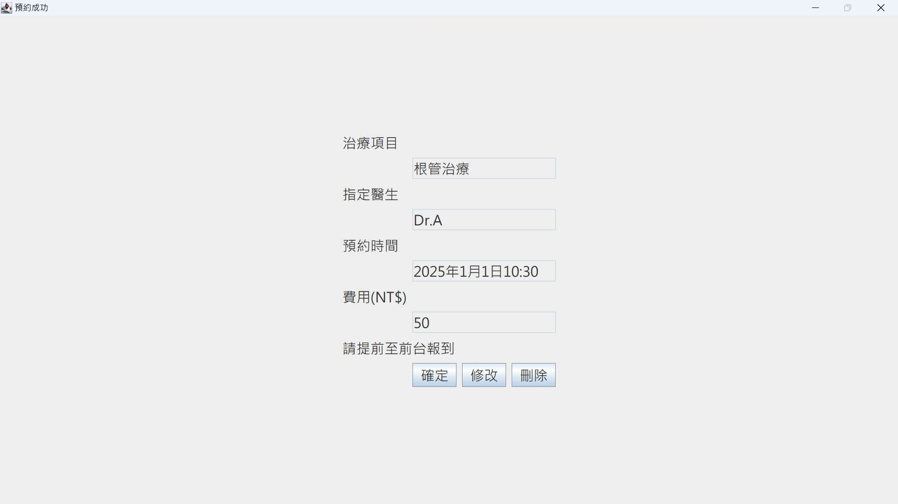

# 牙科預約掛號系統（Dental Appointment System）

> 物件導向程式設計（OOP）課程專題｜以 Java Swing 實作牙醫診所的掛號系統，支援病患註冊、預約看診、現場掛號，以及紀錄的查詢、修改與刪除。

**組員：** 傅珮茵、蔡侑容

---

## 摘要（Abstract）

診所掛號牽涉多種角色與規則：病患身分不同，收費不同；掛號方式不同，需要的資料也不同。

本專案以物件導向方法拆解這些差異。病患抽象為 `Patient`，再分出一般病患與特殊身分病患（榮民、身障）。醫師抽象為 `Dentist`，再分出預約與現場掛號兩種處理方式。系統以圖形介面操作，資料存放於文字檔，不使用資料庫。

系統涵蓋掛號的完整增刪改查：病患可註冊、登入、預約特定醫師與時段、現場掛號，並查詢、修改或刪除自己的紀錄。

## 研究動機（Motivation）

課程要求以繼承、多型與抽象類別完成一個完整專題。掛號系統的規則天然適合這些概念：

- 一般病患與榮民、身障病患，掛號費不同，是繼承與多型的典型案例。
- 預約掛號要指定日期與時段，現場掛號不需要，是同一父類別下的不同行為。
- 註冊時需要收集病史，資料結構需要靈活的欄位管理。

因此以牙醫診所為情境，把課堂概念落實成可操作的系統。

## 系統功能（Features）

### 1. 註冊與登入

- 以身分證字號與密碼登入。
- 首次使用者填寫註冊表單，包含基本資料與 16 項病史問卷。
- 忘記密碼時，輸入身分證字號與生日進行驗證，驗證成功後顯示密碼。

### 2. 輸入驗證

所有輸入皆經過 `Verification` 類別檢查。

| 欄位 | 規則 |
| --- | --- |
| 姓名 | 長度 2–10，不可含特殊字元 |
| 身分證字號 | 共 10 碼；第 1 碼為大寫英文字母；第 2 碼為 1 或 2；後 8 碼為數字 |
| 地址 | 須包含「縣」或「市」，不可含特殊字元 |
| 電話 | 10 碼，且以 09 開頭 |
| 生日 | 不可為未來日期 |
| 密碼 | 須含大寫英文、小寫英文，以及至少四位連續數字 |
| 預約日期 | 不可為已過去的日期 |

### 3. 預約看診

使用者依序選擇治療項目、指定醫師、預約日期與時段。

- 醫師清單依治療項目過濾，只顯示具備該專長的醫師。
- 時段為每日 10:00 至 22:30，每 30 分鐘一格。
- 該醫師當天已被預約的時段，會從選單中移除。
- 病患自己當天已預約的時段，也會從選單中移除，避免同一人重複佔用。

### 4. 現場掛號

使用者選擇治療項目與指定醫師，不需選擇時間。病患已掛號過的治療項目，不會再出現在選單中。

### 5. 查詢、修改與刪除

- 查詢頁面顯示個人資料與所有掛號紀錄。
- 掛號紀錄可修改或刪除。修改的做法是：刪除原紀錄，再開啟對應的掛號頁面重新填寫。
- 個人資料可修改。修改時，身分證字號與生日不可編輯。

### 6. 費用計算

掛號完成後，明細頁顯示應付費用。費用由病患物件的 `calculateCharge()` 計算，同一個呼叫在不同子類別有不同結果。

| 病患類型 | 掛號費 | 健保費 | 合計 |
| --- | --- | --- | --- |
| 一般病患（`normalPatient`） | 150 | 50 | 200 |
| 特殊身分（`SpecialPatient`） | 0 | 50 | 50 |

## 系統設計（System Design）

### 類別圖



### 物件導向概念的運用

| 概念 | 應用位置 |
| --- | --- |
| 抽象類別 | `Patient` 與 `Dentist` 只定義共同介面，不能直接建立物件 |
| 繼承 | `normalPatient`、`SpecialPatient` 繼承 `Patient`；`AppointedDentist`、`On_siteDentist` 繼承 `Dentist` |
| 多型 | 登入後以 `Patient` 型別持有物件，呼叫 `calculateCharge()` 時依實際子類別回傳不同金額 |
| 封裝 | 病患欄位皆為 `private final`，只透過 getter 存取 |
| 組合 | `Patient` 持有 `Detail` 物件，管理病史問卷 |
| 集合框架 | `LinkedHashMap` 依固定順序保存問卷；`ArrayList` 保存醫師專長清單 |
| 靜態工具類別 | `Verification` 集中所有驗證規則 |

### 介面流程

```
StartPage（登入）
 ├─ SignUpPage（註冊）
 ├─ AuthenticationPage（忘記密碼驗證）→ ReviewPage（顯示密碼）
 └─ BasicInfoPage（基本資料與功能選單）
      ├─ AppointedPage（預約）→ AppointedInfoPage（預約明細，可修改或刪除）
      ├─ On_sitePage（現場掛號）→ On_siteInfoPage（掛號明細，可修改或刪除）
      └─ SearchPage（查詢個人資料與紀錄）
```

### 資料檔格式

系統以三個文字檔保存資料，欄位以空白分隔。

| 檔案 | 內容 | 範例格式 |
| --- | --- | --- |
| `Patient.txt` | 病患資料 | `類型 身分證 密碼 姓名 生日 地址 電話 問卷項目:yes/no ...`，類型 `n` 為一般、`s` 為特殊身分 |
| `Register.txt` | 掛號紀錄 | 預約：`身分證 Appointed 治療項目 醫師 年 月 日 時間`；現場：`身分證 On_site 治療項目 醫師` |
| `Dentist.txt` | 醫師與專長 | `醫師名稱 專長1 專長2 ...` |

`Dentist.txt` 共收錄 10 位醫師，涵蓋牙周治療、根管治療、矯正、牙體復形美學、義齒補綴、植牙、製作假牙、檢查、洗牙、補蛀牙、拔牙與牙痛等項目。`Test.java` 可重新產生這份醫師資料。

### 病史問卷

註冊時收集 16 項是非題，包含：是否為特殊身分（榮民、身障）、藥物過敏反應、麻藥不良反應、外傷血流不止、痙攣神智不清、曾有腫瘤癌症、曾有拔牙困難、上顎竇有問題、抽菸喝酒檳榔、高血壓、心臟病風濕熱、糖尿病黃疸病、肝臟病腎臟病、肺結核、內科治療中、骨質疏鬆藥物。

其中「是否為特殊身分」的答案，決定登入後建立哪一種病患物件。

## 執行畫面（Screenshots）

| 登入介面 | 預約看診介面 |
| --- | --- |
|  |  |

| 查詢個人資料 | 查詢預約看診 |
| --- | --- |
|  |  |

## 使用技術（Technologies）

| 類別 | 技術 |
| --- | --- |
| 語言 | Java |
| 圖形介面 | Swing（`JFrame`、`GridBagLayout`、`JComboBox` 等） |
| 資料儲存 | 純文字檔（`BufferedReader`、`PrintWriter`） |
| 輸入驗證 | 自訂規則與正規表示式 |

## 專案結構（Repository Structure）

```
dental_appointment_system/
├── TestLayout-New0617/
│   ├── StartPage.java           # 登入頁與程式進入點
│   ├── SignUpPage.java          # 註冊
│   ├── AuthenticationPage.java  # 忘記密碼驗證
│   ├── ReviewPage.java          # 驗證成功頁
│   ├── BasicInfoPage.java       # 基本資料與功能選單
│   ├── AppointedPage.java       # 預約掛號
│   ├── AppointedInfoPage.java   # 預約明細
│   ├── On_sitePage.java         # 現場掛號
│   ├── On_siteInfoPage.java     # 現場掛號明細
│   ├── SearchPage.java          # 查詢
│   ├── Patient.java             # 病患抽象類別
│   ├── normalPatient.java       # 一般病患
│   ├── SpecialPatient.java      # 特殊身分病患
│   ├── Detail.java              # 病史問卷
│   ├── Dentist.java             # 醫師抽象類別
│   ├── AppointedDentist.java    # 預約掛號處理
│   ├── On_siteDentist.java      # 現場掛號處理
│   ├── Verification.java        # 輸入驗證
│   ├── Test.java                # 產生醫師資料檔
│   ├── Patient.txt              # 病患資料
│   ├── Register.txt             # 掛號紀錄
│   ├── Dentist.txt              # 醫師與專長
│   └── LOGO.png
├── 執行畫面/                     # 系統截圖
├── 相關資料/                     # 專題設計文件與頁面除錯對照表
└── README.md
```

## 安裝與執行（Installation）

**環境需求：** JDK 8 以上。系統使用「微軟正黑體」字型，建議在 Windows 上執行。

原始碼與資料檔為 Big5 編碼，編譯與執行時需指定編碼。

```bash
git clone https://github.com/Fu-Pei-Yin/dental_appointment_system.git
cd dental_appointment_system/TestLayout-New0617

javac -encoding Big5 *.java
java -Dfile.encoding=Big5 StartPage
```

程式以相對路徑讀寫 `Patient.txt`、`Register.txt`、`Dentist.txt`。請在 `TestLayout-New0617` 目錄下執行。

**測試帳號：** `Patient.txt` 內含 4 筆範例病患，可直接以其身分證字號與密碼登入測試。

## 限制與未來工作（Limitations and Future Work）

**限制**

- 資料以文字檔保存，讀寫時需整檔讀入再重寫，資料量大時效率有限。
- 欄位以空白分隔，因此欄位內若含空白，解析會出錯。
- 密碼以明碼儲存於 `Patient.txt`，查詢頁面也會顯示密碼。
- 修改與刪除的方法直接建立並開啟視窗，資料處理與介面耦合。
- `Dentist` 定義了四個抽象方法，但兩個子類別各只實作其中兩個，另外兩個為空方法。
- 系統只有病患端，沒有醫師或櫃台的管理介面。
- 儲存庫內含編譯後的 `.class` 檔與編輯器備份檔（`.java~`）。

**未來工作**

- 改用資料庫（例如 SQLite 或 MySQL）保存資料，並以 SQL 查詢時段衝突。
- 密碼改用雜湊儲存，並移除明碼顯示。
- 把資料存取獨立成專屬類別，介面只負責顯示。
- 重新設計 `Dentist` 的繼承結構，讓每個子類別只包含自己需要的方法。
- 加入醫師與櫃台端功能，例如查看當日看診名單與叫號。
- 補上 `.gitignore`，排除 `.class` 與備份檔。

## 作者（Authors）

傅珮茵（Fu Pei-Yin）、蔡侑容
國立中興大學 資訊管理學系
